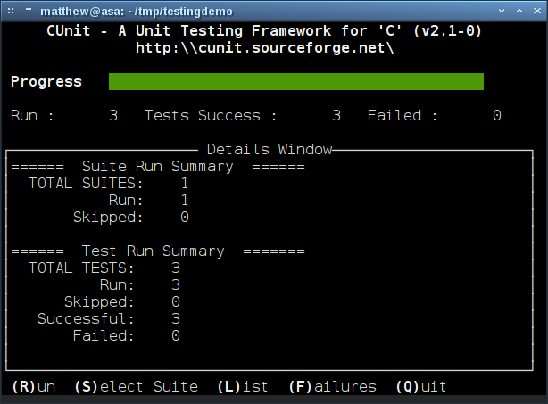

Graph formats abound. As well as documented and widely-supported formats
like
[GEXF](http://www.fim.uni-passau.de/en/fim/faculty/chairs/theoretische-informatik/projects.html),
[GML](http://graphml.graphdrawing.org/)
and
[GraphML](http://gexf.net/format/)
there are as many ad-hoc
or sparsely-documented formats. The latter of these usually arising as
the input or output language for a standalone program implementing specific
graph algorithms.

Suppose that we are trying to accomplish some task involving a
graph and our task involves several steps and several different packages
or programs. For an example we might be trying to colour a graph using one
program, compute the graph’s automorphism group with another program and then
visualise the graph using a third layout program.

In this setting we are likely to export and import our graph in multiple
formats to facilitate using those different packages and we may even be
forced to make ad-hoc manual or scripted changes to the file representation
of the graph, for example to augment the data with vertex properties like
colours or weights. Under these circumstances there is some risk that the graph
file could become corrupted or invalid in some way and no longer represent the
graph it claims to.

How can we be certain that a data file that purports to contain a certain
graph in a specific format really does?

## Testing graph properties

As an example, consider the
[Petersen graph](http://en.wikipedia.org/wiki/Petersen_graph).
This graph
is the smallest bridgeless cubic graph with no three-edge-colouring. We know
some other properties of the Petersen graph, such as it has 10 vertices, 15
edges, radius 2, diameter 2 and girth 5. So a list of testable properties for
the Petersen graph begins something like this:

-   vertices 10,
-   edges 15,
-   radius 2,
-   diameter 2,
-   girth 5,
-   maxdegree 3,
-   …

A property testing program should be able to load a file purporting to
contain a representation of the Petersen graph and test whether or not the
it has these properties.

A graph failing to have all of these properties can certainly be rejected
as not being the Petersen graph. A graph having enough properties in common
with such a list can be said with increasing confidence, up to and beyond
absolute certainty, to really be the Petersen graph.

A more extensive list of properties that the Petersen graph possesses can
be found on
\[here\](http://mathworld.wolfram.com/PetersenGraph.html
on
[Mathworld](http://mathworld.wolfram.com/).

When it comes to storing property data for testing purposes we have at least
three options. One is to store the properties with the graph in the same file.
Another option is to not store the properties but to keep them in the source
code of the testing program itself. A third option is to store properties
externally and separately from the graph data.

In a later post we will discuss in more detail why the third of these options
is preferable. For the purposes of this tutorial our properties will be kept
in JSON format files. Such a file representing the above list of properties
looks like this.

``` javascript
{
  "name": "Petersen Graph",
  "n_vertices": 10,
  "n_edges": 15,
  "radius": 2,
  "diameter": 2,
  "girth": 5,
  "maxdegree": 3,
}
```

In the rest of this tutorial we demonstrate how to test a file in the GML
format against such a JSON list of properties.

## Testing Graph Properties with CUnit

We are going to write a program in C that takes as input a property file
in the above JSON format and a graph in GML format and tests whether the
graph possesses the properties in the property file.

We could write a program from scratch but it benefits us to make us of a
pre-existing test framework. There are many advantages to using a test
framework, the most significant probably being that it greatly enhances
code reuse. Another important feature of a test system built on a test
framework is that all tests are run, regardless whether they succeed or fail.
The testing isn’t halted by a failed test.

There are many test systems for many different languages. We restrict our
attention to test systems for C of which one of the most used is
[CUnit](http://cunit.sourceforge.net/).

There are several steps to creating a test program based on CUnit. In the
following subsections we go through this list explaining each step in detail.

1.  Get parameter data from the JSON property file.
2.  Compute parameters using igraph on the graph data.
3.  Express property tests as test functions.
4.  Create test suites.
5.  Add test suites to a registry
6.  Add test functions to suites.
7.  Run the tests.

## *Get parameter data*

There are numerous choices for reading data from a JSON format file. For our
purposes the library
[Jansson](http://www.digip.org/jansson/)
suffices.

With Jansson the properties file can be loaded with the `json_load_file`
command

``` c
#include <jansson.h>

json_t *json = NULL;
json_error_t error;

json = json_load_file("petersen_properties.json", 0, &error)
```

After the property file has been loaded we use the `json_object_get` command
to access graph properties and store them in variables to be checked later
against computed parameters during the test run.

``` c
json_t *vcount_e, *ecount_e, *girth_e, *diameter_e, *maxdegree_e, *radius_e;

void get_parameter_data() {
 vcount_e = json_object_get(json, "n_vertices");
 ecount_e = json_object_get(json, "n_edges");
 radius_e = json_object_get(json, "radius");
 diameter_e = json_object_get(json, "diameter");
 girth_e = json_object_get(json, "girth");
 maxdegree_e = json_object_get(json, "maxdegree");
}
```

## *Compute parameters*

The values extracted from the properties file can be thought of as expected
parameter values for in the testing scenario (hence the `_e` suffix). Computed
parameters from graph data ought to be in agreement with the expected values.

To compute parameter values from graph data there are several possibilities,
including writing our own routines. In this post, however, we will make use
of the extensive
[igraph](http://igraph.sourceforge.net/)
library.

igraph provides an internal graph data structure, functions for reading the
data from a file into memory and functions for computing graph parameters like
those we are testing.

To load a graph from a file in GML format use the `igraph_read_graph_gml`.

``` c
#include <igraph.h>

igraph_t g;

i_file = fopen("petersen.gml", "r")
igraph_read_graph_gml(&g, i_file);
```

Once the graph itself is loaded we can then compute degree and distance
parameters using the extensive functionality of igraph.

``` c
igraph_real_t radius;
igraph_integer_t diameter, girth, maxdegree;

void compute_all_parameters() {
 igraph_maxdegree(&g, &maxdegree, igraph_vss_all(), IGRAPH_ALL, IGRAPH_NO_LOOPS);
 igraph_radius(&g, &radius, IGRAPH_ALL);
 igraph_diameter(&g, &diameter, 0, 0, 0, IGRAPH_UNDIRECTED, 1);
 igraph_girth(&g, &girth, 0);
}
```

## *Express property tests*

The tests themselves are expressed using CUnit’s wide range of assert macros.
For our purposes we only need one of those macros, `CU_ASSERT_EQUAL` which
tests for equality of its two arguments.

``` c
void test_basic_parameters(void)
{
 CU_ASSERT_EQUAL(igraph_vcount(&g), json_integer_value(vcount_e));
 CU_ASSERT_EQUAL(igraph_ecount(&g), json_integer_value(ecount_e));
}

void test_degree_parameters(void)
{
 CU_ASSERT_EQUAL(maxdegree, json_integer_value(maxdegree_e));
}

void test_distance_parameters(void)
{
 CU_ASSERT_EQUAL(radius, json_integer_value(radius_e));
 CU_ASSERT_EQUAL(diameter, json_integer_value(diameter_e));
 CU_ASSERT_EQUAL(girth, json_integer_value(girth_e));
}
```

## *Create test suites*

The price we pay for the reusability of testing code is that there is some
work to be done to set up the test suites, register them with a test runner and
then run them.

The setup or init function is responsible for loading the two files. If the
file-handling is successful then graph data can be read and both expected
property values and actual parameters can be computed.

``` c
int init_suite(void)
{
 json_error_t error;
 if (NULL == (i_file = fopen("petersen.gml", "r")) ||
   (NULL == (json = json_load_file("petersen_properties.json", 0, &error)))) {
  return -1;
 }

 else {
  igraph_read_graph_gml(&g, i_file);
  get_parameter_data();
  compute_all_parameters();
  return 0;
 }
}
```

Every suite also has a teardown or clean function which is called after all of
the tests in the suite have finished. This function is used to close files that
need to be closed as well to initialise or destroy data structures that have
been used in the tests.

``` c
int clean_suite(void)
{
 if (0 != fclose(i_file)) {
  return -1;
 }
 else {
  igraph_destroy(&g);
  i_file = NULL;
  return 0;
 }
}
```

## *Register suites*

Once we have created setup and teardown functions for our test suite we must
create and add the suite to the registry and give it a name. As suites
correspond to graphs in this testing setting we name the suites after the
graphs whose properties are under test.

``` c
CU_pSuite pSuite = CU_add_suite("Petersen Graph", init_suite, clean_suite);
```

## *Add tests to suites*

With a suite created, test functions can now be added. The `CU_add_test`
function requires the suite, a name for the test and the test itself as
arguments. The test name is used in reporting the success or failure of tests.

``` c
CU_add_test(pSuite, "Basic parameters.", test_basic_parameters)
CU_add_test(pSuite, "Degree parameters.", test_degree_parameters)
CU_add_test(pSuite, "Distance parameters.", test_distance_parameters)
```

## *Run tests*

CUnit provides several test runners. There are basic, non-interactive runners
as well as console and GUI-based interactive ones. On a system with Curses we
can make use of an especially nice Curses-based console interface for running
and monitoring the tests.

``` c
CU_basic_set_mode(CU_BRM_VERBOSE);
CU_curses_run_tests();
CU_cleanup_registry();
return CU_get_error();
```

When the completed test program is compiled and run the output of a successful
run should look something like this:



## Source Code

{}
