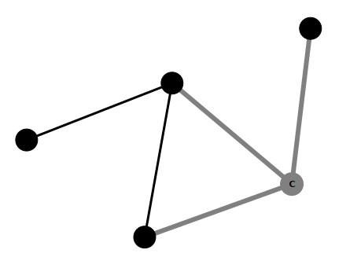

Continuing on from
[an earlier post](/post/2014/03/28/visjs-01),
in
this post we are going to look at some customisation options for
[vis.js](http://visjs.org/).

A lot can be customised in vis.js. Some options, like those
for layout, affect the entire graph. Other options, like node colours and
shapes, affect nodes or groups of nodes. Yet other options, like width and
style, affect edges.

As this blog is focused on graphs that arise in graph theory (as opposed to
Network Analysis or other data-based disciplines) we will aim to reproduce a
traditional style of graph drawing reminiscent of the simple black and white
line drawings found in books and papers on graph theory. In future posts we
will investigate visualisation of colouring algorithms and it will be useful
to have such a default un-coloured style.

We are going to aim for the style of graph shown in this
[example](http://bl.ocks.org/mhenderson/10667009).
Black vertices, no labels, straight edges and a layout that tries to minimise
edge-crossings as far as possible.

There are three steps. First we configure options related to the graph layout,
then we style nodes and finally we style edges.

## Graph Options

In an upcoming post we will look more closely at the different layout
algorithms in vis.js and options for configuration of physics modelling that
allows for dynamic interaction with the rendered graph. In this post we will
settle for a layout with straight edges where nodes are placed by a repulsion
algorithm.

To configure vis.js to produce such a layout involves nothing more than setting
the value of two properties of the options object. This options object is then
passed as a parameter to the `Graph` function.

The `smoothCurves` property has the default value of `true` and by changing
this to false we require vis.js to use straight edges to join nodes.

The `physics` property supports a wide range of options but here all we want
is to disable the Barnes-Hut layout algorithm and revert to a simpler
repulsion layout. This is done by setting to `false` the value of the
`enabled` property of the `barnesHut` property object.

The code below is written in
[CoffeeScript](http://coffeescript.org/)
and we use the
`coffee` compiler to translate it into Javascript.

``` javascript
options =
  smoothCurves: false
  physics:
    barnesHut:
      enabled: false
```

With the CoffeeScript compiler installed and the above code contained in a file
called `options.coffee` we can produce Javascript output with:

    $ coffee --compile --bare options.coffee

Then to configure all graphs in a HTML document we simply have to link to the
resulting Javascript source.

For more information about graph options in vis.js see the
[graph options](http://visjs.org/docs/graph.html#Configuration_options)
pages of the vis.js
[documentation](http://visjs.org/docs/index.html).

## Node Styling Options

Our goal is to have nodes rendered as black filled circles. The shape of a
node is configured by setting the value of the `shape` property of the
`nodes` object. The `color` property is a little more complicated. It
allows us to specify separately the colour of the border and background of a
node. We can also set different values for the border and background when the
node is highlighted.

``` javascript
nodes:
  shape: 'circle'
  fontColor: 'black'
  color:
    border: 'black'
    background: 'black'
    highlight:
      border: 'grey'
      background: 'grey'
```

By choosing to have a black font colour gives a nice side-effect; labels are
not visible on unhighlighted nodes. This is consistent with the graph theory
setting where unlabelled graphs are prevalent.

We have opted for a subtle highlight effect by setting both border and
background to grey. This colour scheme makes node labels visible when selected.

For a comprehensive list of node options see
[this page](http://visjs.org/docs/graph.html#Nodes_configuration)
vis.js documentation.

## Edge Styling Options

The main difference between the default styling of vis.js edges and the
textbook style we are aiming to reproduce is that edges are curves instead of
straight lines. To remedy this requires only that we choose the `'line'`
option for the `style` property in the `edges` object.

``` javascript
edges:
  width: 3
  style: 'line'
  color:
    color: 'black'
    highlight: 'grey'
```

The only other changes we have made are to increase the thickness of the edges
by setting the value of the `width` property and choosing grey as the
highlighting color of edges to match the highlighting of selected nodes.

For a comprehensive list of edge options see
[this page](http://visjs.org/docs/graph.html#Edges_configuration)
vis.js documentation.

## Conclusion

The above configuration gives graph visualisations that looks something like
the traditional line drawings found in graph theory literature.



For now we do not have complete control over the layout. It is generated by
the repulsion algorithm and our interactions after loading the page. In future
posts we will discuss how to configure both the layout algorithms and the
dynamic interactions.

To learn more about the different options that can be configured in vis.js
(of which we have only seen here a small sample) see the
[gallery](http://visjs.org/#gallery)
on the vis.js
[homepage](http://visjs.org).
Some examples that are particularly relevant
are:

-   [Shapes](http://visjs.org/examples/graph/04_shapes.html) example,
-   [Sizing](http://visjs.org/examples/graph/09_sizing.html) example,
-   [Dashed lines](http://visjs.org/examples/graph/13_dashed_lines.html) example,
-   [Custom style](http://visjs.org/examples/graph/11_custom_style.html) example.

## Source Code

{}

{}
