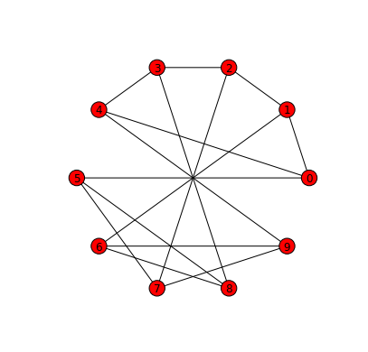
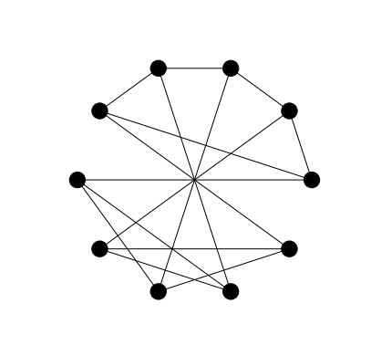
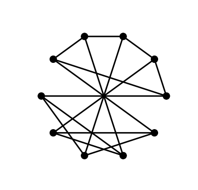
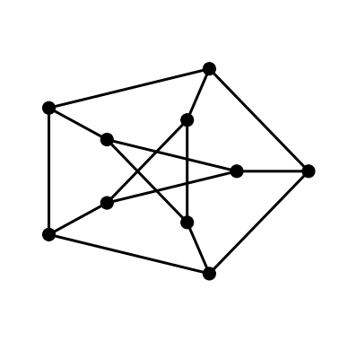
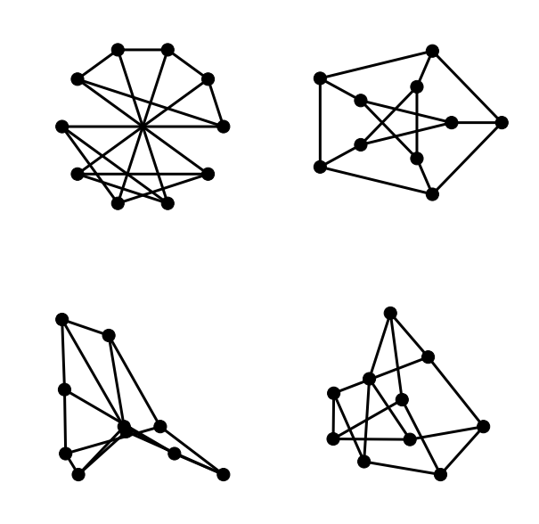
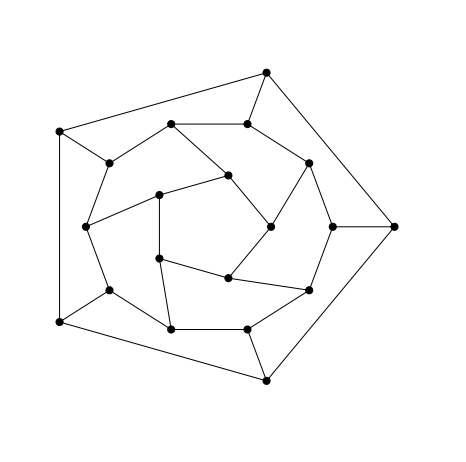
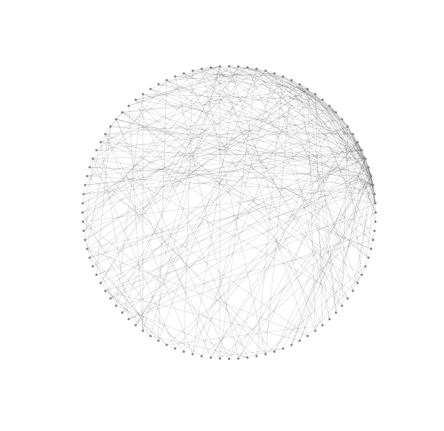
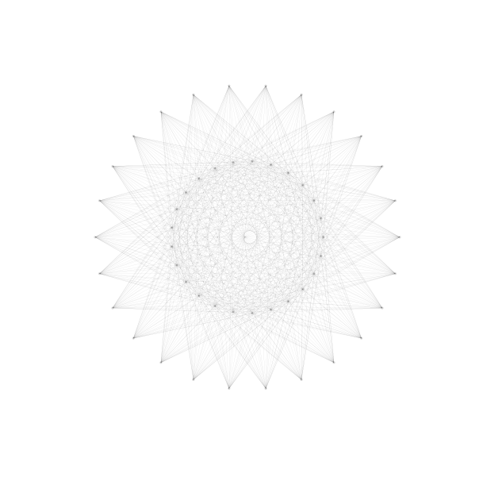
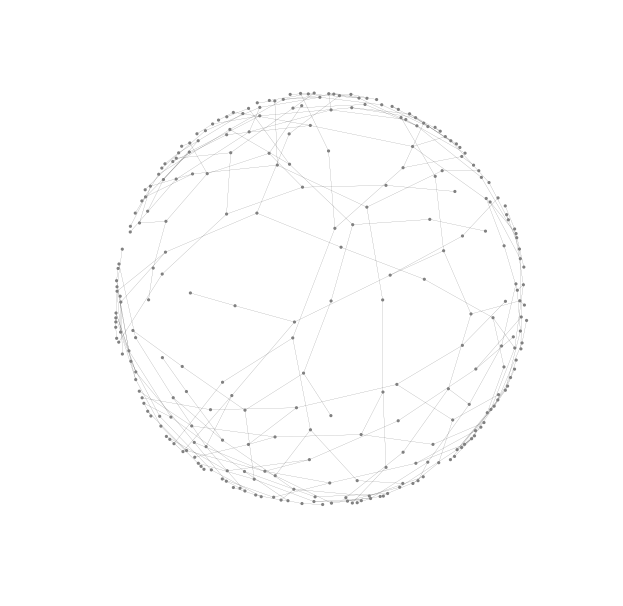
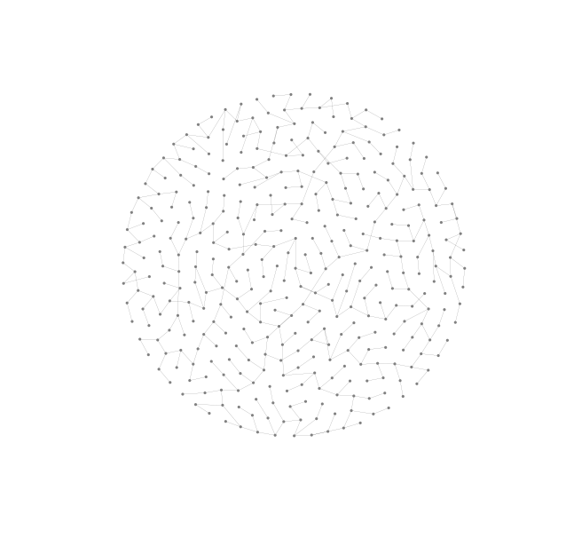

In this post we introduce the drawing functionality of NetworkX.

## 1. Basic Drawing

All drawing in NetworkX can handled by the ``draw`` function. Layouts are
generated using functions like ``circular_layout`` and ``spring_layout`` which
return coordinate mappings that can be used by the ``draw`` function to render
the graph.

In addition, every layout algorithm also has its own convenience function. For
example, the circular layout method can be used by calling the ``draw_circular``
function and the spring layout method can be used through the ``draw_spring``
function.

In this section we will demonstrate how to use both the ``draw`` function and
the different layout functions.

As with all work involving NetworkX, we have to start by importing the package.
We choose to follow the popular convention to import network as ``nx``.

```python
import networkx as nx
```

NetworkX makes many named graphs available. For example, the Petersen graph can
be generated by calling the ``petersen_graph`` function.

```python
G = nx.petersen_graph()
```

One way to draw the Petersen graph with a circular layout is to pass the
``draw`` function a parameter giving the coordinates of the vertices in a
circular layout. These coordinates are the output of the ``circular_layout``
function which takes the graph as a parameter.

```python
nx.draw(G, nx.circular_layout(G))
```



Instead of using the ``draw`` function in conjunction with the
``circular_layout`` function we can use the ``draw_circular`` convenience
function.

The ``draw`` function and all of the layout convenience functions can be
configured to produce graph drawings with different visual properties. Keyword
parameters can be specified to customise things like node colours, edge widths
and whether the graph is displayed with labels or not.

```python
nx.draw_circular(G, with_labels=False, node_color='black')
```



As these configuration options are going to be used on several graphs it makes
sense to put all of the option configurations into a dictionary and then pass
the dictionary as a parameter to the relevant layout function.

```python
options = {
 'with_labels': False,
 'node_color': 'black',
 'node_size': 200,
 'width': 3,
}

nx.draw_circular(G, **options)
```



This drawing is not so easily recognised as a drawing of the Petersen graph. A
more familiar drawings shows one of the five cycles in the shape of a regular
pentagon with another five cycle as a star in the interior joined to the outer
cycle by five spokes. We can achieve this layout in NetworkX with the shell
layout algorithm.

The ``draw_shell`` function takes an optional ``nlist`` keyword argument. The
elements of the list are lists of vertices. The vertices are then arranged in
concentric shells according to the elements of these lists. To find which
vertices lie in the outer shell and which are in the inner shell, along with
their respective orderings requires some experimentation.

```python
nx.draw_shell(G, nlist=[range(5,10), range(5)], **options)
```



## 2. Simple Layouts - graphs with few vertices

NetworkX has the following layout algorithms.

- Circular
- Shell
- Spring
- Spectral
- Random
- Graphviz (through pygraphviz)

We have seen already examples of the circular and shell layouts. The next figure
reproduces those two drawings from above along with examples of the spring and
spectral layouts.

```python
plt.subplot(221)
nx.draw_circular(G, **options)

plt.subplot(222)
nx.draw_shell(G, nlist=[range(5,10), range(5)], **options)

plt.subplot(223)
nx.draw_spectral(G, **options)

plt.subplot(224)
nx.draw_spring(G, **options)
```



The ``plt.subplot`` command will be familiar to anyone with Matlab experience.
It takes an integer argument whose first two digits are interpreted as a number
of rows and columns in a rectangular grid layout and whose third argument is
interpreted as the position of the current figure in the grid. Grid numbering
starts in the top-left corner and proceeds right and downwards to the bottom-
right corner.

## 3. Graphs with a few more nodes

The options we have chosen so far have been suitable for graphs with a few
nodes. When we are drawing larger graphs it makes sense to choose smaller node
sizes and thinner edges so that the various elements of the graph can be easily
distinguished.

```python
options_1 = {
 'with_labels': False,
 'node_color': 'black',
 'node_size': 50,
 'width': 1,
}
```

As with the earlier drawing of the Petersen graph the nodes for the different
layers of the drawing of the dodecahedral graph below were here figured out by
manual experimentation.

```python
G = nx.dodecahedral_graph()
nx.draw_shell(G, nlist = [[2,3,4,5,6],[8,1,0,19,18,17,16,15,14,7],[9,10,11,12,13]], **options_1)
```



## 4. Graphs with many more nodes

If a graph has many nodes then there is a risk, in particular with circular or
shell layouts, that node boundaries can overlap. Choosing small node sizes is a
natural remedy. But when choosing very small nodes edges must also be made very
thin so that we can resolve node edge intersections. Thin edges look grey and
then it is natural to choose grey nodes to match.

```python
options_2 = {
 'with_labels': False,
 'node_color': 'grey',
 'node_size': 10,
 'linewidths': 0,
 'width': 0.1,
}
```

```python
G = nx.barabasi_albert_graph(100, 3)
nx.draw_circular(G, **options_2)
```



## 5. Graphs with many edges

Drawing graphs with many edges requires further tinkering with layout options. A
new problem in this situation is that edges cannot be easily distinguished or
have end vertices that are difficult to recognise. Increasing transparency by
lowering the `alpha` value may have some benefit here.

```python
options_3 = {
 'with_labels': False,
 'node_color': 'grey',
 'node_size': 10,
 'linewidths': 0,
 'width': 0.1,
 'alpha': 0.3
}

G = nx.complete_bipartite_graph(25,26)
nx.draw_shell(G, nlist=[range(0,25), range(25,51)], **options_3)
```



Admittedly, this drawing conveys little information about the graph. It is hard
even to see which nodes in the inner shell are connected to nodes in the outer
shell or if there are any connections between nodes in the inner shell. About
the only information we can interpret is that nodes in the outer shell appear
not to be joined to other vertices in the outer shell. Still, it serves as a
basic example of the kind of issues that we face when trying to draw graphs with
many edges.

## 4. Importing layouts from Gephi

Naturally, some of the problems encountered above are due to poorly chosen
layouts. Better layouts can reduce problems of identifying nodes and edges. Even
better layouts can help to highlight structural properties and symmetries of
graphs.


```python
G = nx.random_lobster(100, 0.9, 0.9)
nx.draw_spring(G, iterations=10000, **options_2)
```



In a
[previous post](/post/2014/05/02/networkx)
we
talked about how to use Gephi to find nice layouts of large lobster graphs. As
an alternative to using NetworkX's layout algorithms we can export our graph,
use Gephi to find a suitable layout and then import the graph data back (now
augmented with coordinate information) and use the raw drawing ability of
NetworkX to render the graph with this layout.

```python
G = nx.read_graphml('/home/matthew/tmp/lobster.graphml')
pos = dict([(v,(G.node[v]['x'], G.node[v]['y'])) for v in G.nodes()])
```

NetworkX loads the graph as a directed graph and will draw directed edges with
arrows unless we set the ``arrows`` keyword argument to ``False``.

```python
nx.draw(G, pos, arrows=False, **options_2)
```



This drawing nearly has it all. The chosen layout almost conveys the planarity
and lobsterity of the graph clearly. With a little manual adjustment we could
eliminate all edge-crossings but because we value reproducibility above all we
have left this drawing in the state generated by Gephi. Another nice property of
the chosen layout is that there are few edge lengths and nodes are evenly
distributed over a symmetrically shaped area, in this case a circle. Not only is
the layout nice but this drawing also has suitably chosen edge widths and node
sizes.
