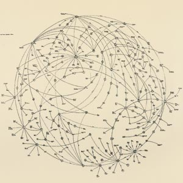
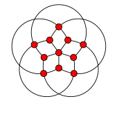
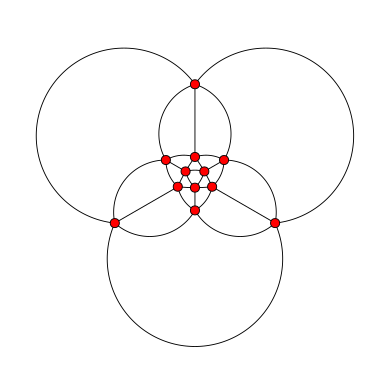
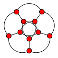

[Mark Lombardi](http://en.wikipedia.org/wiki/Mark_Lombardi)
(1951--2000) was an American artist whose
network diagrams, like the one below, reveal close connections between
actors in the domains of international politics and finance.

In this
post we examine recent work to emulate the aesthetic qualities of Lombardi's
drawings in the realm of graph drawing. More information about Mark Lombardi
can be found in the papers
@zdebikNetworksCorruptionAesthetics2011
and
@friedmanMarkLombardiVisualization2011
and in
[this story](https://www.npr.org/templates/story/story.php?storyId=1487185?storyId=1487185&t=1622551421877)
from a 2003 episode of
Morning Edition on NPR.

Lombardi's diagrams have very strong aesthetic qualities. These qualities have
been attributed, in part, to his use of circular arcs for edges as well as his
efforts to achieve equal spacing of edges around node perimeters; so-called
*perfect angular resolution*.

In
@duncanLombardiDrawingsGraphs2010
the notion of a *Lombardi drawing*
of a graph is introduced. Such a drawing has perfect angular resolution as well
as circular arc edges. The authors describe several methods for finding Lombardi
drawings of graphs and they introduce a Python program called the
[Lombardi Spirograph](https://11011110.github.io/blog/assets/2010/lombardi/LombardiSpirograph.py)
which can produce Lombardi drawings of graphs.

In this post we will demonstrate how to use the Lombardi Spirograph to draw
certain named graphs, how to use options to customise drawings and we will give
two examples of the special input language for drawing graphs other than
named ones.

Drawing Named Graphs
--------------------

The basic usage pattern for the Lombardi Spirograph is:

    $ python LombardiSpirograph.py [options] graph_name > output.svg

where ``graph_name`` is to be replaced by either one of the names of the known
named graphs or by a description of a graph using the specialist input language.

For example, to draw the
[Grötzsch graph](http://en.wikipedia.org/wiki/Gr%C3%B6tzsch_graph)
with the default options:

    $ python LombardiSpirograph.py grotzsch > grotzsch.svg

Which results in the following drawing:

Options
-------

The Lombardi Spirograph allows customisation of several aspects of the produced
drawing. We can scale the drawing and choose different styling options for the
vertices: the colour, size and whether vertices have visible outlines or not.
For example, to draw the Grötzsch graph again, slightly larger with smaller
blue nodes not having visible outlines:

    $ python LombardiSpirograph.py --scale=1.2 --color=blue --radius=0.8 --outline grotzsch > grotzsch_alt.svg

Drawing Other Graphs
--------------------

The input language for drawing other graphs is described by the authors in
the Lombardi Spirograph online documentation. The description can be read by
running the program with the ``--format`` flag.

    $ python LombardiSpirograph.py --format

>   The graph should be described as a sequence of alphanumeric words,
>   separated either by spaces or by blank lines. The first word gives the
>   order of symmetry of the drawing (the number of vertices in each
>   concentric layer) and each subsequent word describes the vertices in
>   a single layer of the graph.

>   Each word after the first takes the form of a (possibly empty) sequence
>   of letters followed by a (possibly empty) number. The letters describe
>   edges connecting two vertices in the same layer: "a" for a connection
>   between consecutive vertices in the same layer, "b" for a connection
>   between vertices two steps away from each other, etc. The letters should
>   be listed in the order the connections should appear at the vertex,
>   starting from the edge closest to the center of the drawing and
>   progressing outwards. Only connections that span less than half the circle
>   are possible, except that the first layer may have connections spanning
>   exactly half the circle.

>   The numeric part of a word describes the connection from one layer to the
>   next layer. If this number is zero, then vertices in the inner layer are
>   connected to vertices in the next layer radially by straight line segments.
>   Otherwise, pairs of vertices from the inner layer, the given number of
>   steps apart, are connected to single vertices in the outer layer. A nonzero
>   number written with a leading zero (e.g. "01" in place of "1") indicates
>   that, as well as connections with the given number of steps, there should
>   also be a radial connection from the inner layer to the next layer that has
>   vertices aligned with it; this may not necessarily be the layer immediately
>   outward.

>   In the innermost layer, the special word "x" may be used to indicate that
>   the layer consists of a single vertex at the center of the drawing. "x0"
>   indicates that this central vertex is connected both to every vertex in
>   the adjacent layer and also to every vertex in the next layer that is
>   staggered with respect to the inner two layers.

Below are two examples. The icosahedron, which is one of the named graphs, and
the Petersen graph, which is also named but in a different way than in the
example below.

*Example 1 -- Icosahedron*

A possible code for a Lombardi drawing of the icosahedron is ``3-a01-01-1-a``.
The drawing that results is:

Here is how to interpret the graph description and see how the above drawing
is produced from it.

* ``3`` - Gives the order of symmetry (vertices in each layer);
* ``a01`` - describes connections with vertices in first (innermost) layer;
    * ``a``  - consecutive vertices in this layer are joined by an edge;
    * ``01`` - pairs of vertices one step apart in this layer are joined to
               vertices in the next layer and there are radial lines to the
               next aligned layer (in this case the third);
* ``01`` - pairs of vertices in second layer which are one step apart in
           this layer are joined to vertices in the next layer and there
           are radial lines to the next aligned layer (the fourth);
* ``1`` - pairs of vertices in second layer which are one step apart in
          this layer are joined to vertices in the next layer;
* ``a`` - consecutive vertices in fourth (outermost) layer are joined by an
          edge.

*Example 2 -- The Petersen Graph*

According to the above description we can deduce that ``5-b0-a`` is a
representation of a drawing of the Petersen graph. The drawing produced by the
Lombardi Spirograph is shown below.

References
----------
