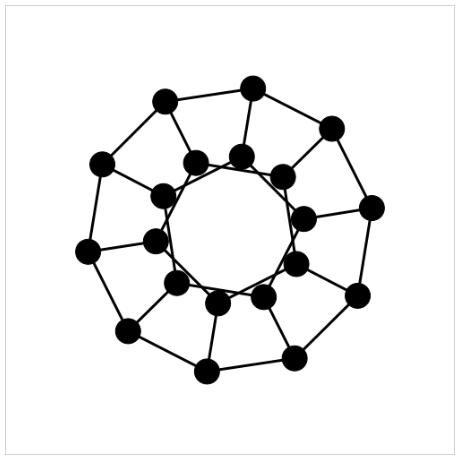
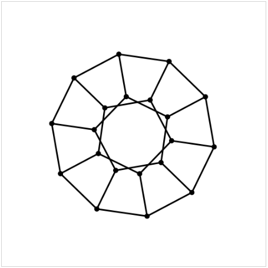
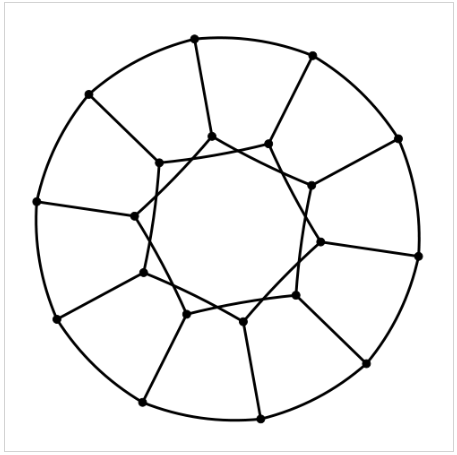

In this post we demonstrate how to take a graph stored in DOT format and draw
it on a webpage using vis.js. The drawing uses vis.js's repulsion layout
algorithm and we also show how to customise this algorithm to improve the
drawing in this one case.

The DOT language
----------------

The
[DOT graph description language](http://www.graphviz.org/doc/info/lang.html)
is the graph format used by
[Graphviz](http://www.graphviz.org/),
one of the oldest graph visualisation tools. More than
just a library or an application, Graphviz is a large collection of tools for
graph visualisation. In an upcoming series we will investigate Graphviz in
detail. For a good introduction to Graphviz try
[Let's Draw a Graph: An Introduction with GraphViz](http://www.eecs.berkeley.edu/Pubs/TechRpts/2013/EECS-2013-176.pdf)
by Marc Khoury.

In this post our interest in the DOT language is due to the fact that vis.js
can load graphs which are written in DOT.

DOT and vis.js
--------------

In the first two posts in this series we saw how to draw graphs using vis.js.
In both of those posts the graph objects were created with vis.js directly with
Javascript in the webpage. This is a reasonable approach for small graphs but a
more common scenario is that we already have a graph contained in a file in some
format and want to use the drawing algorithms of vis.js with this pre-existing
graph data.

In this post we consider the above scenario under the presumption that the
graph data is in DOT format. If we have graph data in a format other than DOT
then we must translate it to DOT format before using vis.js. For GML this can
be done with a script `gml2gv` in the Graphviz project (`.gv` being the
standard file extension for files in DOT format).

In the remainder of this post we will show how to reproduce the drawing of the
dodecahedron grap
([dodecahedron.gv](http://dl.dropboxusercontent.com/u/8432766/dodecahedral.gv))
in the frame below.

<iframe
 width="80%"
 height="450"
 scrolling="no"
 src="http://jsfiddle.net/mjhenderson/HyQ9e/embedded/result/presentation"
 allowfullscreen="allowfullscreen"
 frameborder="0">
</iframe>

Requesting Graph Data
---------------------

To use external graph data with vis.js needs a little more work than simply
calling a load or import function. The feature of vis.js that allow us to work
with external data in the DOT language is the ability for the the `Graph`
function to be initialised with a string of DOT data. So to use external data
what is needed is to first create a string of DOT data from a file in DOT
format.

To do this we have to make a HTTP request. This is best done asynchronously to
allow graph data to be loaded while the page is being rendered. One approach is
to use JQuery.
[Other approaches](http://youmightnotneedjquery.com/)
are possible but JQuery makes it very easy in this case.

```javascript
$.ajax({
 url : "http://dl.dropboxusercontent.com/u/8432766/dodecahedral.gv",
 success : function(dot_str){
  var container = document.getElementById('graph');
  var graph = new vis.Graph(container, {dot: dot_str}, options);
 }
});
```

JQuery has an `ajax` function for making asynchronous HTTP requests. To make
a GET request we simply have to provide a `url` string as an argument to the
`ajax` function. In fact, because we are going to also provide other settings,
it is just as easy to pack the `url` string as a key-value pair inside an
object with other key-value pairs and pass the entire object as a parameter
to the `ajax` function.

In this case, the only other setting required inside this parameter object is
the `success` setting. The value of this setting is a function called when the
request succeeds. The data returned by the request is passed to this function
as a parameter which allows us access to the data inside the function body.

To build a `Graph` object from this data (called `dot_str`) we call the
`Graph` function as usual but this time the second parameter, the data
argument, is an object which contains a mapping from a `dot` key to the DOT
string data which was passed into the function body when the HTTP request
succeeded.

The `container` and `options` objects have been created as in previous posts.
In the next section we show how to modify the `options` object to customise
the layout of the graph so the resulting drawing is more suitable than the
default.

Repulsion Layout Configuration
------------------------------

Layouts in vis.js are determined in a dynamic way after graph data has been
loaded and thus vary from one page view to the next. Nevertheless, there are
some aspects of the default drawing which are consistently undesirable and that
we can fix even if we can't completely control the exact appearance of the final
graph-drawing. With default settings for the repulsion algorithm a drawing
obtained by vis.js of the dodecahedron graph looks something like this:



The edges in this drawing are, arguably, too short relative to the node sizes.
We can fix this by allowing the repulsion algorithm to allow nodes to be placed
further apart thus making nodes appear smaller relative to the drawing size.

Several variables control the behaviour of the repulsion algorithm. These
variables and their effects on the graph drawing are described in the table
below, which is taken from the vis.js documentation.

| Name             | Type   | Default | Description                                          |
|------------------|--------|:-------:|------------------------------------------------------|
| `centralGravity` | Number |   0.1   | The central gravity is a force that pulls all nodes  |
|                  |        |         | to the center. This ensures independent groups do    |
|                  |        |         | not float apart.                                     |
| `springlength`   | Number |    50   | in the previous versions this was a property of the  |
|                  |        |         | edges, called length. This is the length of the      |
|                  |        |         | springs when they are at rest. During the simulation |
|                  |        |         | they will be stretched by the gravitational fields   |
|                  |        |         | To greatly reduce the edge length, the               |
|                  |        |         | `centralGravity` has to be reduced as well.          |
| `nodeDistance`   | Number |   100   | This parameter is used to define the distance of     |
|                  |        |         | influence of the repulsion field of the nodes. Below |
|                  |        |         | half this distance, the repulsion is maximal and     |
|                  |        |         | beyond twice this distance the repulsion is zero.    |
| `springConstant` | Number |   0.05  | This is the spring constant used to calculate the    |
|                  |        |         | spring forces based on Hooke's Law.                  |
| `damping`        | Number |   0.09  | This is the damping constant. It is used to          |
|                  |        |         | dissipate energy from the system to have it settle   |
|                  |        |         | in an equilibrium.                                   |

A very useful feature of vis.js is an interactive interface that allows you to
configure these values and then export the resulting configuration. To enable
this interface just set the value of the `configurePhysics` option to `true`.

```javascript
options =
  configurePhysics: true
``` 

Now when the page is viewed we are presented with the following interactive
interface which can be used to experiment with different settings for the
three different layout algorithms offered by vis.js.

<iframe
 width="100%"
 height="800"
 scrolling="no"
 src="http://jsfiddle.net/mjhenderson/HyQ9e/9/embedded/result/presentation"
 allowfullscreen="allowfullscreen"
 frameborder="0">
</iframe>

With straight edges the drawing of dodecahedron graph by the repulsion
algorithm under the default variable settings has very short edges. To increase
the edge length first increase the `springLength` setting, from 50 to 250, say.
Increasing only the `springLength`, however, results in a poor layout because
now the node distance prevents nodes from moving farther apart. The remedy is
to increase node distances. Through experimentation a value of 250 for the
`nodeDistance` gives a layout that makes the symmetry of the dodecahedron
clear.

When the desired settings have been found use the `Generate Options` button
to create option code which can be cut-and-pasted into the drawing document.

```
physics:
  repulsion:
   centralGravity: 0.1
   springLength: 250
   springConstant: 0.05
   nodeDistance: 250
   damping: 0.09
```

With those settings the drawing of the dodecahedron produced by vis.js looks
something like the next image.



Choosing smooth curves produces a drawing with circular arcs and nearly perfect
angular resolution. Such drawings are called *Lombardi Drawings*. See
[Lombardi Spirograph I: Drawing Named Graphs]()
for further information.



Complete Source Code
--------------------

The source code for the above example is shown below in a JSFiddle viewing
widget. The same code is also available as a
[gist](https://gist.github.com/MHenderson/9767847)
on Github, the output
of which can be viewed on
[blocks.org](http://bl.ocks.org/mhenderson/9767847).

<iframe
 width="100%"
 height="650"
 scrolling="no"
 src="http://jsfiddle.net/mjhenderson/HyQ9e/embedded/js,css,html"
 allowfullscreen="allowfullscreen"
 frameborder="0">
</iframe>

Further Examples
----------------

On the vis.js homepage
[this example](http://visjs.org/examples/graph/14_dot_language.html)
and this
[playground](http://visjs.org/examples/graph/15_dot_language_playground.html)
demonstrate the use of the DOT language in vis.js.

There is also
[another useful example](http://visjs.org/examples/graph/25_physics_configuration.html)
on the vis.js homepage of
configuration options for the physics component of vis.js.
