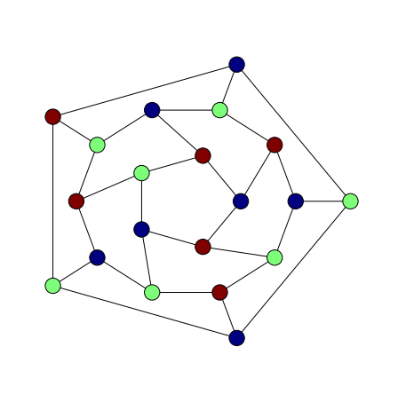
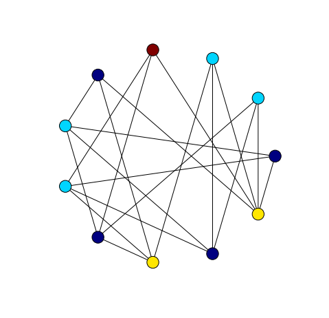

The previous two posts were about greedy colouring small graphs. In the
first post an implementation of the greedy algorithm in Python with NetworkX
was used to colour all graphs on at most 7 vertices. We compared different
vertex orderings by counting, for different ordering strategies, the total
number of colours used on this set of graphs. In the subsequent post we
repeated this experiment and extended it to graphs on at most 8 vertices
using Culberson's colouring programs.

Perhaps surprisingly, Culberson's programs did much better than our Python
implementation. The most likely explanation is simply that our greedy colouring
Python code is broken. Before we can conclude this, though, it is probably a
good idea to investigate colouring the same set of graphs using another vertex
colouring algorithm.

The goal of this post then is to introduce a slightly different approach
to graph colouring, the method of recursive
independent set removal.

Chromatic Numbers of Small Graphs
----------------------------------

The minimal total number of colours used in a proper colouring of all graphs
on at most seven vertices is 3348, computed from the following table which is
found on
[Gordon Royle's Small Graphs data page.](http://staffhome.ecm.uwa.edu.au/~00013890/remote/graphs/)


The total number of colours used by Culberson's `greedy` program with
descending degree vertex ordering was 3616. The total number of colours used
by the NetworkX-based implementation was 4120.

These values differ by 504, which seems quite a large discrepancy as a
proportion of the minimum of 3348 colours. What could be the cause? Or is
this not a significant discrepancy? It seems to me that there are
a few possibilities. The most likely explanations are problems with the
data sets used in the experiments or a flaw in our implementation of
the greedy algorithm. These possibilities should be eliminated first before
embarking on a larger study to decide whether the discrepancy is significant
or not.

Whatever are the reasons for the discrepancy it seems that some testing and
verification of both graph data and colourings is in order. Seeing as we have
been avoiding this issue in earlier posts it seems like an appropriate time
to improve the reliability of our data.

To this end, it would be useful to have still more than implementations of
vertex colouring. In this post we implement another vertex colouring algorithm
based on the idea of recursively extracting a large independent set.

Colouring by Stable Set Recursion
---------------------------------

The implementation in NetworkX of recursive maximal independent set extraction
is very simple because NetworkX implements the algorithm from
@boppanaApproximatingMaximumIndependent1992
in the function `maximal_independent_set`. Notice that
this is a *maximal* independent set algorithm, not a *maximum* independent set
algorithm. So at each level of recursion, we find an approximation to a
maximum independent set. With small graphs this approach seems reasonably
successful.

```python
from copy import deepcopy

def __vcolour3__(G, C, level=0):
    """Vertex colouring by recursive maximal independent
       set extraction."""
    H = deepcopy(G)
    if (H.number_of_nodes() > 0):
        V1 = nx.maximal_independent_set(H)
        for v in V1: C[v]['colour'] = level
        H.remove_nodes_from(V1)
        __vcolour3__(H, C, level + 1)

def vcolour2(G):
    """Interface for vertex colouring by recursive maximal
       independent set extraction."""
    return __vcolour3__(G, G.node)
```

With the Petersen graph, for example, we find a minimal colouring with three
colours:

```python
import networkx as nx

P = nx.petersen_graph()
vcolour2(P)

nx.draw_shell(P, nlist = [range(5,10), range(5)], node_color = colours(P), **options)
```


With the dodecahedral graph we can find also a minimal 3-colouring although we
have to make sure to seed the random number generator suitably.

```python
import random
random.seed(0)

setfigsize(6, 6)

G = nx.dodecahedral_graph()
vcolour2(G)
nlist = [[2,3,4,5,6],[8,1,0,19,18,17,16,15,14,7],[9,10,11,12,13]]
nx.draw_shell(G, nlist = nlist , node_color = colours(G), **options)
```



We also find a minimal 4-colouring of the Grotzsch graph.

```python
G = nx.read_graph6('graph_1132.g6')

vcolour2(G)
nx.draw_circular(G, node_color = colours(G), **options)
```



### Colouring Small Graphs

For comparison with the colourings from the previous weeks we colour all graphs
on at most seven vertices and count the total number of colours.

```python
import networkx as nx

graphs = nx.graph_atlas_g()
colours_used = []

for G in graphs:
    vcolour2(G)
    colours_used.append(ncolours(G))
    clear_colouring(G)

sum(colours_used)
4293
```

This value is closer to the larger value of total colours used by our NetworkX
based implementation of greedy vertex colouring. In upcoming posts we will
return to the question of testing graph data so that we can rule out problems
with the graph data used in these experiments.

References
----------
