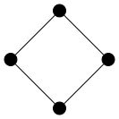
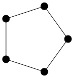
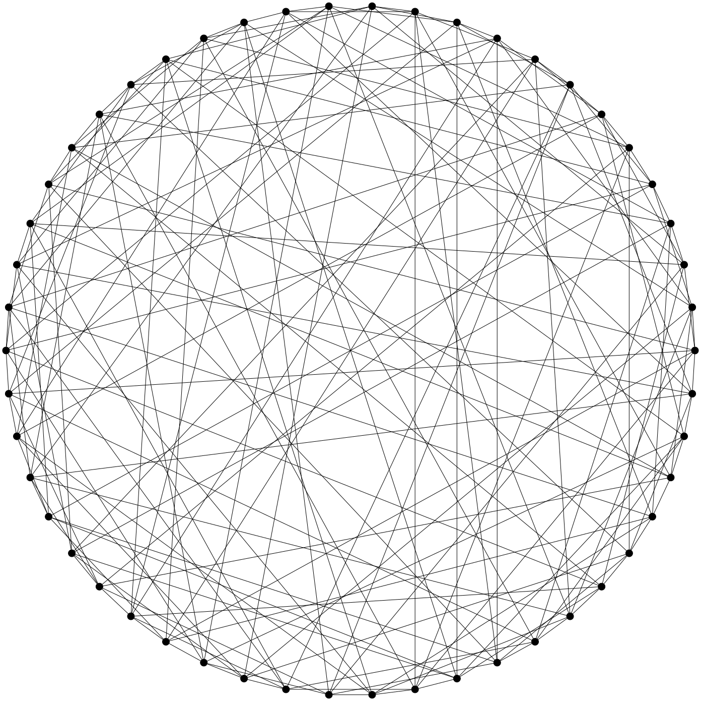

With `geng` we can generate graphs in *graph6* format. For example, to generate
all connected simple graphs of order four:

    $ geng -qc 4
    CF
    CU
    CV
    C]
    C^
    C~

Here, the `-q` switch suppresses some auxilliary output and `-c` specifies
connected graphs.

We can specify a class of graphs having certain properties, such as size, degree
bounds, existence of cycles, connectedness or bipartiteness. For example, to
generate all connected, bipartite graphs of order four with maximum degree two:

    $ geng -qcb -D2 4
    CU
    C]

We can visualise these graphs using `listg` to convert the output to *DOT*
format and the using one of the *Graphviz* programs to draw them. If we have
many options to pass to the drawing program it makes sense to pack them all into
a variable for future use.

    $ options="-Nfixedsize=true\
               -Nlabel=\
               -Nshape=circle\
               -Nheight=0.2\
               -Nwidth=0.2\
               -Nstyle=filled\
               -Nfillcolor=black"

    $ geng -qcb -D2 4\
      | listg -y\
      | circo -Tsvg -O $options




These two graphs answer a very easy conjecture about the existence of graphs
having the following properties:

* four vertices,
* maximum degree two,
* connected,
* bipartite.

Many problems in graph theory can be expressed as the existence of graphs
satisfying a list of properties like this. The existence of Moore graphs, for
example, is a problem yet to be completely resolved which takes this simple
form. So it might be nice to have a little program `moore`, that filters Moore
graphs from the output of `geng`.

Then if we should wish, for example, to draw all Moore graphs on five vertices
we can modify the above pipeline accordingly:

    $ echo `geng -qc 5`
      | moore
      | listg -y
      | circo -Tsvg -O $options




In this post we show how to program such a filter in Bash and Maxima, albeit one
which is fatally flawed.

Moore Graphs
------------

A *Moore graph* is a graph with diameter $d$ and maximum degree $k$ which
has the maximum number of vertices for a graph with the same diameter and
maximum degree.

In
@cameronCombinatoricsTopicsTechniques1994
it is shown that a Moore graph is any
graph satisfying the following conditions (any two of which imply the third):

* $G$ is connected with maximum degree $k$ and diameter $d$;
* $G$ has minimum degree $k$ and girth $2d + 1$;
* $G$ has $1 + k\frac{(k - 1)^{d} - 1}{k - 2}$ vertices.

If the output from the pipeline at the end of the previous section is correct
then there are only two Moore graphs of order five, $K_{5}$ and $C_{5}$.

* $d = 1$. $K_{n}$ and $C_{3}$ are the only Moore graphs.
* $d = 2$. The Hoffman-Singleton theorem says that a Moore graph must have
  $k \in \{2, 3, 7, 57\}$.

    * $k = 2$ the unique Moore graph is $C_{5}$.
    * $k = 3$ the unique Moore graph is the Petersen graph.
    * $k = 7$ the unique Moore graph is the Hoffman-Singleton graph (shown
      below).
    * $k = 57$ unknown whether there exists a hypothetical Moore graph which
      would necessarily have girth 5 and order 3250.

* $d \geq 3$. According to @damerellMooreGraphs1973 and
  @bannaiFiniteMooreGraphs1973 the only Moore graphs is $C_{2d + 1}$.

To draw the Hoffmann-Singleton graph:

    $ curl http://staffhome.ecm.uwa.edu.au/~00013890/remote/cages/cagesk7g05.s6\
      | listg -y\
      | circo -Tsvg -O $options



Processing Graph Data with Maxima
---------------------------------

The three conditions in the previous section form the basis of the Moore graph
filter below. By itself we can't use *geng* to identify Moore graphs because any
two of these conditions involve computing either the girth or diameter.

Maxima, the computer algebra system, has a graphs library which includes
functions that compute the girth and diameter of graphs. Even better, it also
provides conversion to and from *graph6* format.

Because the program we are going to write is supposed to work within a pipeline
we will use Maxima in batch mode, rather than interactively. To avoid working
with multiple source files we will use the `--batch-string` option to pass a
program to Maxima as a string.

One drawback with Maxima is that there is a little bit of processing to be done
one the output of any program because, even running in batch mode with minimal
verbosity, Maxima still outputs a lot of extraneous text.

As the basic structure of the program is relatively complicated we will begin
with an example. This example also serves to highlight an important
consideration when it comes to the speed of the program.

In the listing below is a Bash program that calculates the degree of every graph
in an input string of whitespace-delimited graphs in *graph6* format.

    #!/bin/bash

    while read
    do
     s="
     load(graphs)$
     g: graph6_decode(\"$REPLY\")$
     graph_size(g);
     "
     maxima --very-quiet --batch-string="$s"\
      | tail -n 1\
      | tr -d ' \t\r\f[]'\
      | tr ',' '\n'
    done

Unfortunately, this approach is incredibly slow for at least two obvious
reasons. The first is that for every graph we run a new instance of Maxima. The
second is that each of these many instances of Maxima has to import the *graphs*
library.

A different approach, which is much faster, is to read the entire list of graphs
as a string, convert that string into the string representation of a Maxima list
of strings and hand that to one instance of Maxima to process. The following
listing does just that.

    #!/bin/bash

    read g6raw
    g6proc=$(echo $g6raw |
             awk '{  print "\"" $1 "\"" "," }' RS=' ' ORS=' ' |
             sed '$s/. $//')
    g6list="["${g6proc}"]"

    s="
    load(graphs)$

    g6list: $g6list$
    glist: map(graph6_decode, g6list)$
    l:map(graph_size, glist)$
    printf(true, \"~{~a,~}\", l);
    "

    maxima -q --very-quiet --batch-string="$s"\
     | tail -n 1\
     | tr -d ' \t\r\f'\
     | tr ',' '\n'\
     | head -n -1

This approach presents some new problems. Firstly, because we read the entire
output of *geng* into one string we have to use `echo geng`. A worse problem is
that we quickly run out of memory, even for very small values of the graph
order. Nevertheless, for the sake of experimentation, we continue with this
approach for the Moore graphs application. In the worst case it will make a
reasonable base for future development.

Filtering Moore Graphs
----------------------

Assuming that input is a string of whitespace-delimited graphs in *graph6*
format we start by building a Bash string representing a Maxima list of the
same *graph6* format strings.

    read g6raw
    g6proc=$(echo $g6raw |
             awk '{  print "\"" $1 "\"" "," }' RS=' ' ORS=' ' |
             sed '$s/. $//')
    g6list="["${g6proc}"]"

The *AWK* program here surrounds all strings with double-quotes and adds a
separating comma. The *Sed* hack removes the last comma and the final assignment
statement puts the entire list of strings into a string surrounded by a pair of
square braces, the Maxima syntax for a list.

Now we have the data in a format that can be passed to Maxima we build the
entire Maxima program as a Bash string. The core of the program is a function
`moore1(G)` which decides whether the graph `G` is a Moore graph or not.

    moore1(G):=
     (
      K: max_degree(G)[1],
      k: min_degree(G)[1],
      d: diameter(G),
      g: girth(G),
      is_connected(G) and is(g = 2*d + 1 and k = K)
     )$

Here `max_degree`, `min_degree`, `diameter`, `girth` and `is_connected` are all
functions from the Maxima *graphs* library. The `is` function is one of the core
Maxima functions for Boolean predicate testing.

The function `moore1(G)` has no return statement because Maxima functions which
are made up from a simple list of statements in this way return the last
evaluated value by default.

For comparision, although not discussed further here, we also implemented
another two functions for testing whether a graph is a Moore graph or not. These
are based on the remaining two ways of choosing a pair of conditions from the
list above.

    moore2(g):=
     (
      k: max_degree(g)[1],
      d: diameter(g),
      expected_order: 1 + k*(((k - 1)^d - 1)/(k - 2)),
      is_connected(G) and is(graph_order(g) = expected_order)
     )$

    moore3(g):=
     (
      k: min_degree(g)[1],
      d: (girth(g) - 1)/2,
      expected_order: 1 + k*(((k - 1)^d - 1)/(k - 2)),
      is(graph_order(g) = expected_order)
     )$

With the testing function implemented we turn to the *graphs* library and its
`graph6_encode` and `graph6_decode` functions to convert the incoming data and
the outgoing results.

    g6list: $g6list$
    glist: map(graph6_decode, g6list)$
    moore_graphs: sublist(glist, moore1)$
    map(graph6_encode, moore_graphs);

All of the above code is the content of a Bash string which is handed to Maxima
for batch processing. This approach makes it easy, e.g `g6list: $g6list` to pass
data from Bash to Maxima. After the Maxima program has finished we need to use
`tail` and `tr` to clean up the output so that we only see the graph data and
none of the auxilliary output of Maxima.

    maxima --very-quiet --batch-string="$s"\
      | tail -n 1\
      | tr -d ' \t\r\f[]'\
      | tr ',' '\n'

In its present state the final script correctly identifies the Moore graphs on
at most six vertices. With some improvement we hope to extend this to graphs of
order at most nine.

Source Code
-----------

```{r, echo=FALSE}
blogdown::shortcode("gist", "MHenderson", "462eb071cb80151ad133")
```

References
----------

