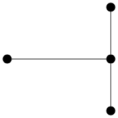
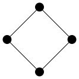
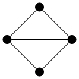
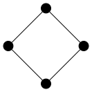
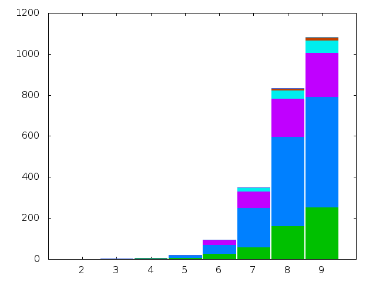

In this post we compute the chromatic index of all graphs
on at most nine vertices with ten edges or fewer.

As in
[Colouring Small Graphs](/post/2014/07/25/colouring-small-graphs)
and
[Colouring Small Graphs: Update](/post/2014/08/08/colouring-small-graphs-update)
the source code for this experiment is presented as a Drakefile. As this Drakefile
very similar to the Drakefiles for those earlier experiments we try to add some
value by making several improvements to the quality of the source code in the
hope of improving the generalisability of our method and the reproducibility of
our results.

Overview
--------

The goal is to compute the chromatic indices of all graphs whose order is at
most nine. In this experiment we do part of this computation for graphs whose
size is at most ten. The reason why we look at graphs with only a small number
of edges is that we are using the `chromatic` program on the line graph $L(G)$
to compute the chromatic index $\chi^{\prime}(G)$ of $G$ (justified by the
observation that $\chi^{\prime}(G) = \chi(L(G))$). The `chromatic` program is
slow for graphs on more than ten vertices. Therefore, as the order of $L(G)$
is equal to the size of $G$, we are restricted to graphs of small size.

As with the earlier experiments into the chromatic number, we consider connected
graphs as a separate case. Also, the sets of graphs, both connected and all
graphs, are sets of non-isomorphic graphs.

So there are two simulations whose results are presented below.

* The chromatic indices of all non-isomorphic connected simple graphs with
  order at most nine and size at most ten.
* The chromatic indices of all non-isomorphic simple graphs with order at most
  nine and size at most ten.

As things stand, we have very little in the way of verification of our results
other than a little by-hand checking of total counts of graphs compared against
[data generated by Gordon Royle](http://staffhome.ecm.uwa.edu.au/~00013890/remote/graphs/numbers/n9.html).

Experimental Details
--------------------

The graph data we use is generated by *geng* from the *gtools* collection from
[*nauty*](http://cs.anu.edu.au/~bdm/nauty).
To specify graphs of a specific size using *geng* we can
provide the size as an optional extra argument after the order. For example, to
generate all non-isomorphic connected graphs on four vertices with three edges
(here piped through *listg* into *circo* for visualisation purposes):

    $ geng -qc 4 3 | listg -y | circo -Tsvg -O $options




where `$options` was previously defined as:

    $ options="-Nfixedsize=true\
               -Nlabel=\
               -Nshape=circle\
               -Nheight=0.2\
               -Nwidth=0.2\
               -Nstyle=filled\
               -Nfillcolor=black"

To generate graph data with a range of sizes an optional size argument can be
given as a range in the form `min:max` where 0 for the upper bound is interpreted
as $n \choose 2$. For example, to generate all non-isomorphic connected graphs
of order four with size at least four:

    $ geng -qc 4 4:0 | listg -y | circo -Tsvg -O $options





For the purposes of computing chromatic indices we transform every graph into
its line graph. Line graphs can be constructed with the *linegraphg* program
from *gtools*. For example, the linegraphs of the previous four graphs are:

    $ geng -qc 4 4:0 | linegraphg -q | listg -y | circo -Tsvg -O $options





The `-q` switch for `linegraphg`, as with `geng`, suppresses auxiliary output.

As we have done in earlier experiments, we take the generated graph data in DOT
format and, using *csplit*, split it across multiple files with one graph per
file.

The resulting line graph data is then processed by chromatic in the identical
manner described in
[Colouring Small Graphs](/post/2014/07/25/colouring-small-graphs).
The
resulting data on the distribution of chromatic numbers (here, interpreted as
chromatic indices) is then collated and tabulated, also identically as in the
previously mentioned post. That distribution data is presented below in the
results section along with two plots whose construction is explained now.

The table created by joining together the per-order distributions of
chromatic indices is not in the perfect format for plotting with Gnuplot so a
Drake rule transforms it into a new tab separated values file with an
extra header row added and the final row of column totals removed.

    output/data.tsv <- output/table.txt
      head -n-1 $INPUT\
      | sed -e '1i X\t2\t3\t4\t5\t6\t7\t8\t9\t' >> $OUTPUT

Another rule then transforms the above generated tsv data into a plot. The
plotting is done by Gnuplot, implemented as a Drake method exploiting a
little hack to pipe a Gnuplot program into Gnuplot.

    plot()
      echo "\
       clear;
       reset;
       set style data histogram;
       set style histogram columnstacked;
       set style fill solid border;
       set boxwidth 0.95 relative;
       unset key;
       set term png;
       set output \"$[OUTPUT]\";
       plot for [COL=$[ORDER_MIN]:$[ORDER_MAX]] '$[INPUT]' using COL title columnheader;
      " | gnuplot

    output/histogram.png <- output/data.tsv [method:plot]

The variables appearing in the Gnuplot program string are all Drake variables.
The $INPUT and $OUTPUT variables are the normal automatically generated
variables set when the method is called from the rule to which the
method is attached. The $ORDER_MIN and $ORDER_MAX variables are set manually
inside the Drakefile and are used elsewhere.

Results
-------

|                |    $$n = 2$$    |   3   |   4   |   5   |   6   |   7   |   8   |   9   | 
|:--------------:|:---------------:|------:|------:|------:|------:|------:|------:|------:|
|  $$\chi =  2$$ |        0        |   1   |   2   |   1   |     2 |     1 |     2 |     1 |
|         3      |        0        |   1   |   4   |   8   |    26 |    58 |   162 |   254 |
|         4      |        0        |   0   |   0   |  10   |    45 |   193 |   435 |   538 |
|         5      |        0        |   0   |   0   |   2   |    21 |    80 |   187 |   215 |
|         6      |        0        |   0   |   0   |   0   |     0 |    18 |    39 |    59 |
|         7      |        0        |   0   |   0   |   0   |     0 |     0 |     9 |    13 |
|         8      |        0        |   0   |   0   |   0   |     0 |     0 |     0 |     4 |
|         9      |        0        |   0   |   0   |   0   |     0 |     0 |     0 |     0 |
|    Total:      |        0        |   2   |   6   |  21   |    94 |   350 |   834 |  1084 |



|                |    $$n = 2$$    |   3   |   4   |   5   |   6   |   7   |   8   |   9   | 
|:--------------:|:---------------:|------:|------:|------:|------:|------:|------:|------:|
|  $$\chi =  2$$ |        0        |   1   |   3   |   5   |    10 |    15 |    26 |    37 |
|         3      |        0        |   1   |   5   |  14   |    46 |   123 |   350 |   772 |
|         4      |        0        |   0   |   0   |  10   |    55 |   258 |   749 |  1476 |
|         5      |        0        |   0   |   0   |   2   |    23 |   104 |   305 |   568 |
|         6      |        0        |   0   |   0   |   0   |     0 |    18 |    57 |   125 |
|         7      |        0        |   0   |   0   |   0   |     0 |     0 |     9 |    22 |
|         8      |        0        |   0   |   0   |   0   |     0 |     0 |     0 |     4 |
|         9      |        0        |   0   |   0   |   0   |     0 |     0 |     0 |     0 |
|    Total:      |        0        |   2   |   8   |  31   |   134 |   518 |  1496 |  3004 |


Source Code
-----------

```{r, eval=TRUE, echo=FALSE}
blogdown::shortcode("gist", "MHenderson", "26c4ac03f81f476b6526", "Drakefile")
```
