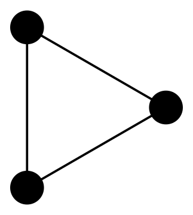
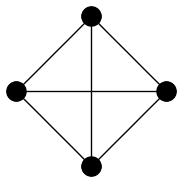
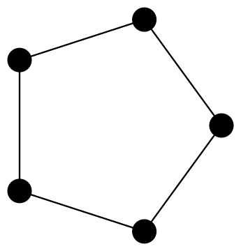
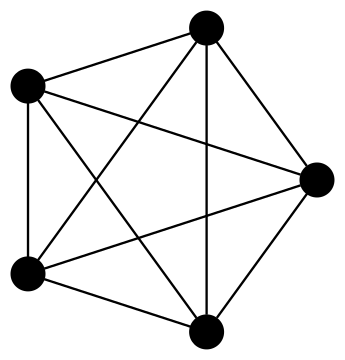
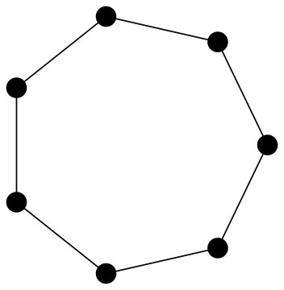
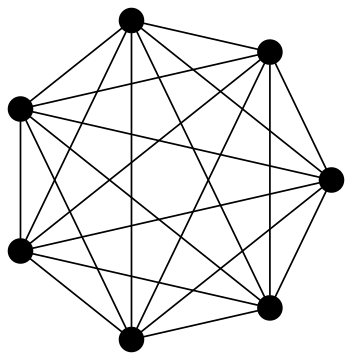
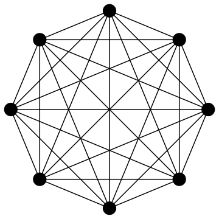
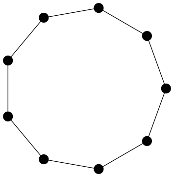
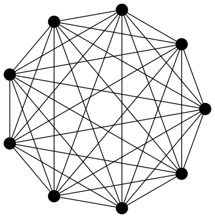
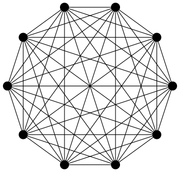

In
[Small Moore Graphs](/post/2014/08/22/moore-graphs)
we developed
`moore`, a filter for Moore graphs in *graph6* format. The virtue of a program like
`moore` is that it can be used in pipelines with existing programs to create new
programs, as demonstrated in that earlier post.

In its present form (at time of writing) `moore` filters Moore graphs from a
string of whitespace delimited graphs in *graph6* format. So, to use it in a
pipeline we have to ensure that the input is a single string, rather than raw
standard input:

    $ echo `geng -qc 4` | moore
    C~

Beyond this small design flaw, `moore` has a few other, as yet unresolved,
issues. For example, it fails to filter the Moore graphs of order seven from a
string of all non-isomorphic connected graphs on seven vertices.

    $ echo `geng -qc 7` | moore
    --anerror.Todebugthistry:debugmode(true);

Rather than fix these problems immediately, in this post, we build an
alternative implementation of the same program. Before, with `moore` we used
Bash and Maxima. Here we will Python with both the
[NetworkX](http://networkx.lanl.gov/)
and
[igraph](http://igraph.org/)
packages. The former for its *graph6* handling and the latter
for degree, girth and diameter calculations.

## Iterating Over Graphs with Python

The resulting program, `moore.py` will read graphs in *graph6* format from
standard input and echo back those graphs which are Moore graphs.

One approach to working with standard input in Python is to use the `stdin`
object from the `sys` module of the standard library. The `stdin` object has a
`readlines` method that makes iterating over lines of standard input as simple
as:

``` python
from sys import stdin

for line in stdin.readlines():
    # Do something
```

We will expect here that each `line` is a *graph6* format string. Inside the
body of the loop we then need to do the following three things:

1.  parse the *graph6* string into a graph object `G`,
2.  check if `G` is Moore graph or not and, if it is,
3.  echo the original input `line` on standard output.

The first of these steps can be handled by the `parse_graph6` function from
NetworkX. The only processing we do on each `line` is to strip whitespace on
the right using the `rstrip` string method.

The result of parsing is a `networkx.Graph` object `g`. As NetworkX does not
implement girth computation we construct a second `igraph.Graph` object `G` from
`g.edges()`, the list of edges of `g`.

``` python
from sys import stdin

from networkx import parse_graph6

from igraph import Graph

if __name__ == "__main__":
    for line in stdin.readlines():
        stripped_line = line.rstrip()
        g = parse_graph6(stripped_line)
        G = Graph(edges = g.edges())
        moore = moore_gd
        if moore(G):
            print stripped_line
```

Testing for Moore graphs is done by a function `moore` (here pointing to one of
three alternative implementations `moore_gd`, `moore_nd` and `moore_gn`). In the
next section these three different functions are described.

## Testing Moore Graphs

As seen in
[Small Moore Graphs](/post/2014/08/22/moore-graphs)
there
are, at least, three different ways to test whether a graph is a Moore graph
or not. Those three methods are based on a theorem from
Cameron (1994)
which says that a graph is a Moore graph if
it satisfies any two of the following three conditions:

1.  `\(G\)` is connected with maximum degree `\(k\)` and diameter `\(d\)`;
2.  `\(G\)` has minimum degree `\(k\)` and girth `\(2d + 1\)`;
3.  `\(G\)` has `\(1 + k\sum_{i=0}^{d-1}(k - 1)^{i}\)` vertices.

The third condition gives the maximum order of a `\(k\)`-regular graph with
diameter `\(d\)`. As this is a value we need in more than one place it gets its
own function.

``` python
def moore_order(d, k):
    """
    In a regular graph of degree k and diameter d the order is
    at most moore_order(d, k).
    """
    return 1 + k*sum([(k - 1)**i for i in range(d)])
```

Now `moore_gn`, which is based on the combination of conditions 2 (involving
girth) and 3 (involving order) above can be implemented for `igraph.Graph`
objects as follows:

``` python
def moore_gn(G):
  """
  Decide if G is a Moore graph or not, based on order and girth.
  """
  return G.vcount() == moore_order((G.girth() - 1)/2, min(G.degree()))
```

Remembering that every graph which satisfies conditions 2 and 3 above is also
regular and connected might persuade us to consider some optimisations
here. For example, as the minimum degree of vertices must be calculated we might
as well also compute the maximum degree and avoid `moore_order` and `girth`
calculations for any graph for which those values differ.

Similarly, we might also dismiss any graph which isn’t connected. Optimisations
like these require some experimentation to determine their worth. Also, when
programs like `geng` have already efficient ways to generated connected and
regular graphs there will be circumstances when we only want the essential
computation to be done. So at present we will concentrate on building a reliable
implementation and leave such considerations for the future.

With disregard for optimisation in mind, the other testing functions based
on the remaining combinations of conditions 1, 2 and 3. are also very simple
one-liners. The girth and diameter variant looks like:

``` python
def moore_gd(G):
  """
  Decide if G is a Moore graph or not, based on girth and diameter.
  """
  return G.girth() == 2*G.diameter() + 1
```

While the version based on order and diameter is:

``` python
def moore_nd(G):
  """
  Decide if G is a Moore graph or not, based on order and diameter.
  """
  return G.vcount() == moore_order(G.diameter(), max(G.degree()))
```

## Results

Now we can construct all Moore graphs on at most 10 vertices in a single
pipeline involving `geng` and `moore.py`. Here the resulting graphs are
visualised with `circo` from Graphviz after conversion to *DOT* format using
`listg`:

    $ options="-Gsize=5,5!
               -Nfixedsize=true
               -Nlabel=
               -Nshape=circle
               -Nheight=0.2
               -Nwidth=0.2
               -Nstyle=filled
               -Nfillcolor=black"

    $ seq 1 10\
      | xargs -L1 geng -qc\
      | moore.py\
      | listg -y\
      | circo -Tsvg -O $options














# Source Code

{}

## References

<div id="refs" class="references csl-bib-body hanging-indent">

<div id="ref-cameronCombinatoricsTopicsTechniques1994" class="csl-entry">

Cameron, Peter J. 1994. “Combinatorics: Topics, Techniques, Algorithms.” Higher Education from Cambridge University Press. Cambridge University Press. October 6, 1994. <https://doi.org/10.1017/CBO9780511803888>.

</div>

</div>
