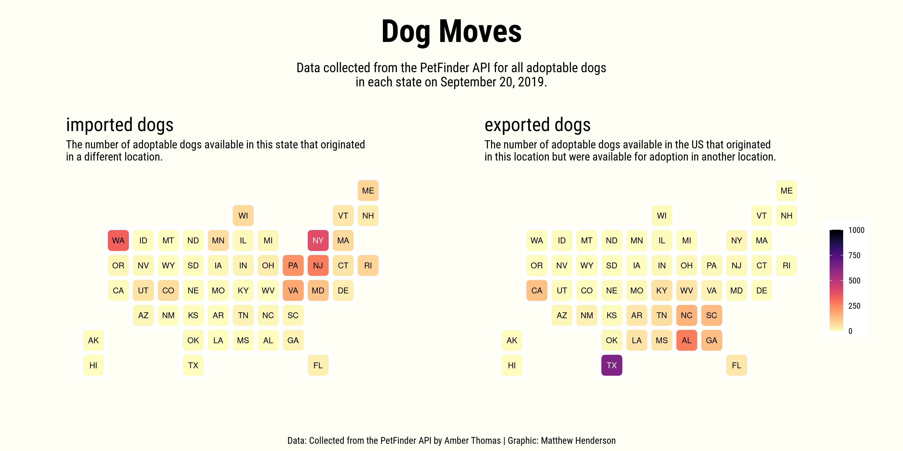
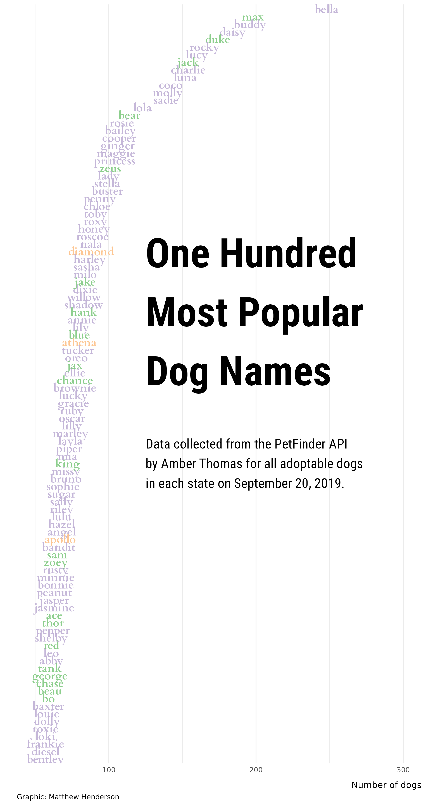

Tidy Tuesday
for week fifty-one
of 2019
was all about
dogs available for adoption
in the United States
through PetFinder.

The data was collected by
Amber Thomas
for her piece
[Finding Forever Homes](https://pudding.cool/2019/10/shelters/)
which appeared
in
The Pudding
in October 2019.

There were three data sets.
One data set about
dogs that were moved between
states for adoption.
Another
described where dogs
were orginally found.
The third gave
detailed information about
every dog.

I created two plots from this data.

The first plot shows how
imports
and exports vary by state.
I used
Bob Rudis’s
{statebins}
package
Rudis (2020)
for this plot
as well as
Thomas Lin Pedersen’s
{patchwork}
package
Pedersen (2020).

You can see that
lots of dogs are exported
from southern states,
particularly Texas.
You can also see that
lot of dogs are imported
to northern states
like Washington
and New York.

The second plot shows
the one hundred
most popular
dog names
among all dogs available
for adoption.

The colour of a name
in this plot
indicates whether it
has one,
two
or three syllables.
I used
Tyler Rinker’s
{syllable}
package
Rinker (2017)
to do this.

## References

Pedersen, Thomas Lin. 2020. “Patchwork: The Composer of Plots.” Manual.

Rinker, Tyler W. 2017. “Syllable: A Small Collection of Syllable Counting Functions.” Manual. Buffalo, New York. <http://github.com/trinker/syllable>.

Rudis, Bob. 2020. “Statebins: Create United States Uniform Cartogram Heatmaps.” Manual. <https://gitlab.com/hrbrmstr/statebins>.

