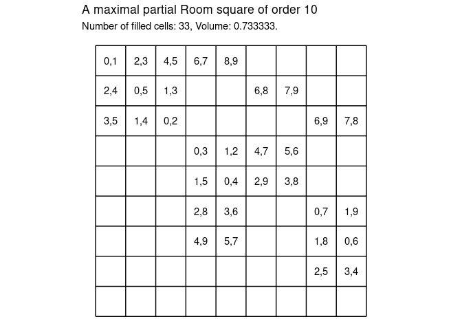
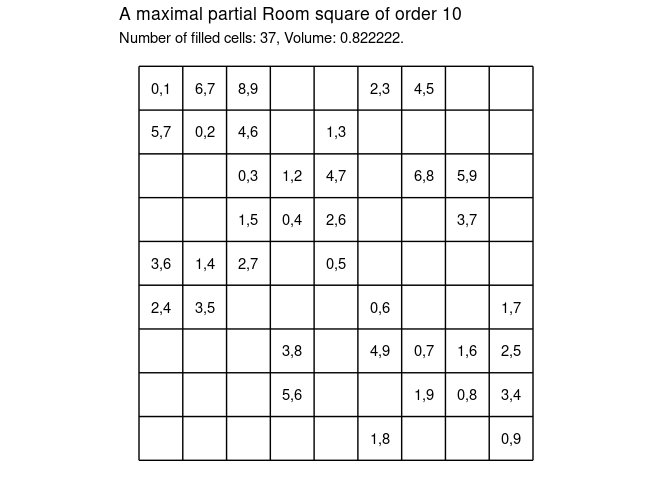

```{r setup, include=FALSE}
knitr::opts_chunk$set(
        echo = TRUE,
     message = FALSE,
     warning = FALSE,
     comment = "#>",
    collapse = TRUE
)
```

# Examples of Maximal Room Squares

A **Room square** of order $n$ and side $n − 1$ on an $n$‐element set $S$ is an
$n - 1 \times n - 1$ array filled with $n$ different symbols in such a way that:

1. Each cell of the array is either empty or contains an unordered pair from the set of symbols
2. Each symbol occurs exactly once in each row and column of the array
3. Every unordered pair of symbols occurs in exactly one cell of the array.

A **partial Room square** of order $n$ and side $n − 1$ on an $n$‐element set $S$ is
an $n - 1 \times n - 1$ array $F$ satisfying the property (1) above, and also

4. every symbol of $S$ occurs at most once in each row and at most once in each column of $F$
5. every unordered pair of symbols of $S$ occurs in at most one cell of $F$.

A partial Room square is **maximal** if no further pair of elements of $S$ can be placed into any unoccupied cell of $F$ without violating the conditions (1), (4), (5).

## Greedy maximal Room squares

There are at least two deterministic ways to create maximal partial Room squares.

One way is to iterate through the cells in order placing into the next empty cell the next pair that doesn't violate the conditions of being a partial Room square.

Another way is to iterate through the set of unordered pairs placing the next unordered pair into the first available cell which so as not to violate the conditions of being a partial Room square.

In
@meszkaMaximalPartialRoom2021
the authors call the first process `greedy1` and the second `greedy2`.

In the repository accompanying this blog post both `greedy1` and `greedy2` have
been implemented in R.

[GitHub - MHenderson/maximal-room-squares: Generate maximal Room squares.](https://github.com/MHenderson/maximal-room-squares)

## Examples

### greedy1

```r
library(tictoc)
n <- 10
tic()
R <- greedy1(n)
toc()
#> 0.17 sec elapsed
```



### greedy2

```r
n <- 10
tic()
R <- greedy2(n)
toc()
#> 0.239 sec elapsed
```




## Appendix - Implementation Details

### Room data frames

A partial Room square can be represented by a data frame with four columns:
`row, col, first, second`
where every row represents either a filled or an empty cell.

The empty cells are those with `NA` in both columns `first` and `second` while filled cells have non `NA` values in both `first` and `second`.

To create an empty partial Room square use `expand_grid` from **tidyr** to create `row` and `col` columns then use `mutate` from **dplyr** to add `first` and `second` columns.

```r
empty_room <- function(n) {
 expand_grid(row = 1:(n - 1), col = 1:(n - 1)) %>%
 mutate(first = as.numeric(NA), second = as.numeric(NA))
}
```

It may seem as if there is something wrong here but
a Room square of order $n$ really does have $n - 1$ rows and $n - 1$ columns.

### Available symbols

For every empty cell $e$ in a partial Room square for there is a subset of
**available symbols**. These are the symbols from 
${0, ..., n - 1}$
that don't appear anywhere in the same row or same column as $e$.

Rather than calculating this set whenever it's needed a more practical approach
is for every cell to maintain an up-to-date list of available symbols.

For an empty Room square all symbols are available for every cell.

```r
R <- empty_room(n) %>% mutate(avail = list(0:(n - 1)))
```

The lists in `avail` are not magically self-maintaining.
We have to make sure to remove symbols from all lists in the same row and column
whenever we fill an empty cell.

### Unused pairs and empty cells

Prior to iterating through cells or pairs of symbols initialise global lists of unused pairs and empty cells.
These lists can be updated during the iteration phase,
making it possible at any step to determine which cells are empty and which pairs are unused.

### Main loop structure

Suppose that $E$ is a global list of empty cells and $P$ is a global list of unused pairs.
The structure of greedy1 then looks something like this.

```r
for(e in E) {

  # 1. calculate available symbols for e

  # iterate through unused pairs in given order
  for(p in P) {

    # 2. if empty cell e is suitable for pair p then:

      # 3. assign p to cell e
      # 4. remove e from the global list of empty cells
      # 5. remove p from the global list of pairs
      # 6. remove both elements of p from lists of symbols missing in row e[1]
      # 7. remove both elements of p from lists of symbols missing in col e[2]
      # 8. stop

  }

}
```

### Details

#### 1. Calculate available symbols for an empty cell $e$

Filter the Room data frame to just the row representing cell $e$, the available symbols are those in the vector in list column **avail**:

```r
available <- R[R$row == e[1] & R$col == e[2], "avail"]$avail[[1]]
```

The reason for calculating `available` here instead of inside the nested loop where
it gets used is because it doesn't change until we assign something to $e$.
So if we were calculating it for every pair $p$ being test inside the nested loop then all but one of those computations would be redundant.

#### 2. Test suitability of pair $p$ for $e$

Test if both `p[1]` and `p[2]` are found in `available` computed in step 1:

```r
p[1] %in% available && p[2] %in% available
```

#### 3. Assign $p$ to empty cell $e$

Use two assignments, one for each element of $p$.

Filter the Room dataframe to the row corresponding to $e$:

```r
R[R$row == e[1] & R$col == e[2], ]
```

Assign the first element of p to the first column:

```r
R[R$row == e[1] & R$col == e[2], "first"] <- p[1]
```

Assign the second element of p to the second column:

```r
R[R$row == e[1] & R$col == e[2], "second"] <- p[2]
```

#### 4. Remove e from the global vector of empty cells

Use the `match` function to find indices of elements of E matching empty cell e.
Use this vector of matching indices to construct a new vector containing all elements of E that don't match.
Replace E with this new vector:

```r
E <- E[-match(list(e), E)]
```

#### 5. Remove p from the global vector of available pairs

A very similar approach to the one taken in 4 works here as well:

```r
P <- P[-match(list(p), P)]
```

#### 6. Remove both elements of p from lists of available symbols for all cells in the current row

If there happened to exist a function `remove_both(X, p)` that would remove both elements of a pair p from X and further, if L were a list of vectors for which it was desired to remove both elements of p from every vector in L then

```r
lapply(L, remove_both, p)
```

would do the trick.

Now

```r
R[R$row == e[1], "avail"]$avail
```

is a list of vectors each of which represents available symbols for a cell in the same row as e so:

```r
lapply(R[R$row == e[1], "avail"]$avail, remove_both, p)
```

removes both elements of p from every list of available symbols for cells in the same row as e.

Therefore

```r
R[R$row == e[1], "avail"]$avail <- lapply(R[R$row == e[1], "avail"]$avail, remove_both, p)
```

updates the list of available symbols of cells in the same row as e with a new list of sets of available symbols from which both elements of p have been removed.

#### 7. Remove both elements of p from lists of available symbols for all cells in the current column

This is almost the same as 6:

```r
R[R$col == e[2], "avail"]$avail <- lapply(R[R$col == e[2], "avail"]$avail, remove_both, p)
```

#### 8. Stop

if you don't remember to break from the loop at this point then you will continue to inspect candidate pairs even after having found a suitable one.

## greedy2

Having implemented greedy1 there is almost nothing left to do to implement greedy2.
Simply change the nesting of the loops.
Now at the top level iterate over P instead of E while at the inner level iterate of E instead of P.

```
for(p in P) {

  for(e in E) { }

}
```

## References
