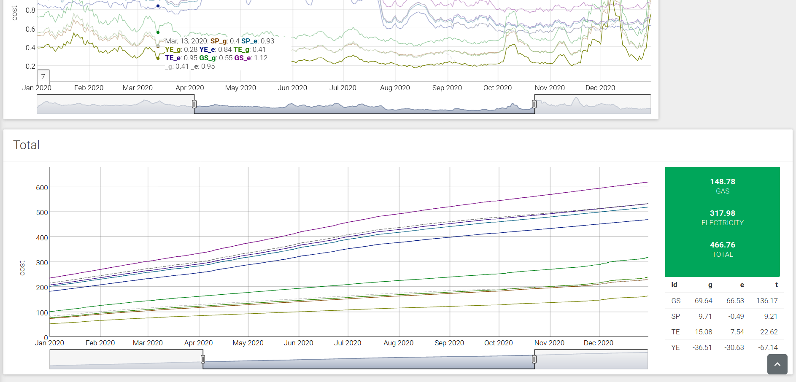

I use the
[energyuse](https://mhenderson.shinyapps.io/energyuse/)
app
to monitor
my consumption of gas
and electricity
at home.

The app
is built on
[Shiny](https://www.rstudio.com/products/shiny/)
and
[Golem.](https://thinkr-open.github.io/golem/)

It uses
[shinydashboardPlus](https://rinterface.github.io/shinydashboardPlus/index.html)
and
[shinywidgets](https://dreamrs.github.io/shinyWidgets/index.html)
for the user interface
and
[dygraphs](https://rstudio.github.io/dygraphs/)
for plotting.

The
[source](https://github.com/MHenderson/energy-use)
is available on Github.

