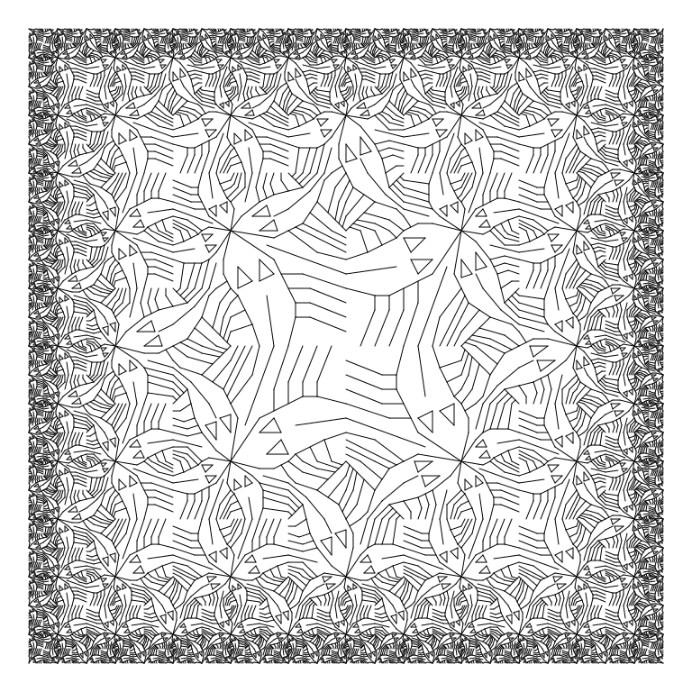

Functional Geometry in R.

* [documentation](https://mhenderson.github.io/funcgeo/) - on Github pages
* [source](https://github.com/MHenderson/funcgeo) - on Github
* [Functional Geometry in R](https://mjh.netlify.app/post/2018/01/16/functional-geometry-in-r/) - blog post.

