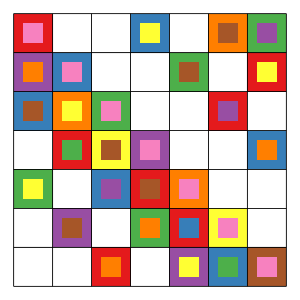

A **Room square**
is an $n × n$ array filled with $n + 1$
different symbols in such a way that:

  1. Each cell of the array is either empty or contains an unordered pair
     from the set of symbols
  2. Each symbol occurs exactly once in each row and column of the array
  3. Every unordered pair of symbols occurs in exactly one cell of the array.

In the above image colours are used instead of symbols.
This is a $7 \times 7$ Room square because every colour appears
once in every row and every column (either as the
inner coloured square or as the coloured border around
the inner coloured square)
and because every colour appears
once with every other colour.

For example, red appears with pink in the first
row, yellow in the second, purple in the third, green
in the forth, brown in the fifth, blue in the sixth
and orange in the seventh.

  * The code to generate this image
    can be found in
    [tidy-room-squares](/projects/tidy-room-squares)

  * [room](/projects/room)
    is a survey about Room squares (work-in-progress).

  * [room-squares-bib](/projects/room-squares-bib)
    is an annotated bibliography.

  * [room-square-generator](/projects/room-square-generator)
    is an implementation in Java of
    the hill-climbing algorithm by
    @dinitzHillClimbingAlgorithmConstruction1987
    for constructing Room squares.

## References
